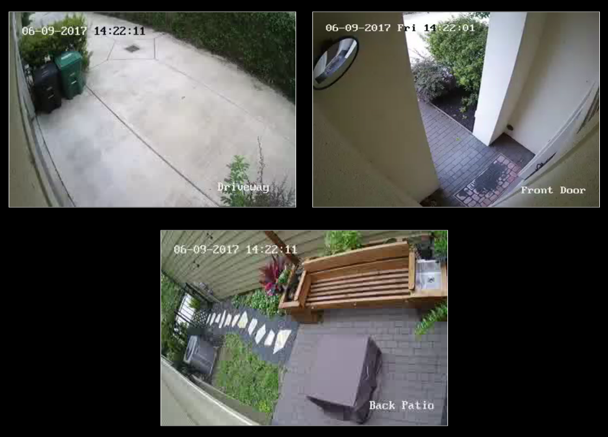

# MMM-RTSPStream - Video Streaming from Live Feeds (Security Cameras)

This is a module for the [MagicMirror²](https://github.com/MichMich/MagicMirror/).

This module will show a live RTSP video stream and/or periodic snapshots on the Magic Mirror from any IP Security Camera which supports the [RTSP protocol](https://github.com/shbatm/MMM-RTSPStream/wiki/Stream-URLs-for-Various-Cameras) and/or can serve a snapshot periodically.

> :warning: This module is no longer being actively developed. I will accept PRs and leave the repo active, but will not be directly supporting any issues. If anyone is interested in assuming ownership of the module, please contact @shbatm. :warning:
>
> Why?
>  - I am no longer using this module on my own mirror. After several years, I found that I use the snapshots much more frequently than I streamed the actual cameras, which can be performed by much simpler modules and methods. To enable streaming, WebRTC (like [MMM-HomeAssistant-WebRTC](https://github.com/Anonym-tsk/MMM-HomeAssistant-WebRTC)) is a newer and better standard with much lower server overhead and latency for delivering RTSP Streams to the frontend than any of the options used here, in the future, this will be the method  I focus on and I will not try to shoehorn another technology into this module.
>  - Update 5-Oct-2022: See alternative module [MMM-RTSPtoWeb](https://github.com/shbatm/MMM-RTSPtoWeb) for a drastically simplified module relying on WebRTC and a backend server.

### Features:

* Supports single or multiple camera streams/snapshots
* For multiple streams: supports rotating through streams in a single window or displaying multiple windows (with customizeable layout)
* Supports fetching snapshots from a file or url when not actively streaming
* Flexible configurations to limit resource use on Raspberry Pi --
    - Stops all streams when module is hidden
    - Option for AutoPlay or manual starting of stream
    - Plays one or all streams (when displaying multiple)
    - *Note:* 3 simultaneous streams on a RaspberryPi 3 is about the limit for usability.
* Support for [MMM-KeyBindings](https://github.com/shbatm/MMM-KeyBindings) module for Play/Pause Remote Control and navigation of multiple streams
* Hardware-Accelerated Playback on the main screen, with option to use software playback on a remote browser window.
* When using `omxplayer` or `vlc`, double-clicking the play button (or longpressing PlayPause key if using MMM-KeyBindings) will play the video fullscreen. Click anywhere once (or Pause with MMM-KeyBindings) to exit.

### Dependencies:

* The following packages are required for the module to function fully and the installer will attempt to install them with `apt`:
    * `ffmpeg`, `omxplayer`, `vlc`, `devilspie2`, `wmctrl`
* For hardware-accelerated streaming, `vlc` or `omxplayer` is required.
* For manipulating VLC's windows, `devilspie2` and `wmctrl` are used.
* For software-decoded streaming and/or remote browser viewing:
    - Requires `jsmpeg` for front-end display of stream.
    - Requires `node-rtsp-stream-es6` Node.js module and `ffmpeg` for backend.
    - Video flow using `'ffmpeg'`: Camera RTSP Stream → `ffmpeg` pre-processor → MM module's `node_helper.js` (via `node-rtsp-stream-es6`) → Web Socket (`ws`) → MagicMirror² (via `jsmpeg`)

## Screenshot:



## Installation:

### Quick install

If you followed the default installation instructions for the [Magic Mirror²](https://github.com/MichMich/MagicMirror) project, you should be able to use the automatic installer.
The following command will download the installer and execute it:
```bash
bash -c "$(curl -s https://raw.githubusercontent.com/shbatm/MMM-RTSPStream/master/scripts/installer.sh)"
```

## Updating after a Module Update:

Re-run the installation script above, or do the following:

```shell
cd ~/MagicMirror/modules/MMM-RTSPStream
git pull
npm install
```

## Using the module

**To use this module, use the configuration builder tool included.**

1. Install the module (see above).
2. Add the following to your config:
````shell
    {
        module: 'MMM-RTSPStream',
        position: 'middle_center',
        config: {
            initialSetup: true,
        }
    }
````
2. Open a web-browser and navigate to: http://your-mirror-ip:8080/MMM-RTSPStream/config.html
3. Use the tool to generate your config details.
4. Copy the section you your MagicMirror `config.js` file.
5. Restart the MagicMirror

## Configuration options

It is highly recommended you use the tool included. Several sample configurations are available on [this wiki page](https://github.com/shbatm/MMM-RTSPStream/wiki/Sample-Configurations), detailed options are listed below.

| Option           | Description
|----------------- |-----------
| `autoStart`      | Start the stream(s) automatically<br>*Default:* `true`
| `rotateStreams`  | `true`: Rotate through all streams in a single window<br>`false`: Display an individual window for each stream<br>*Default:* `true`
| `rotateStreamTimeout` | Time (in sec) to show each stream when `rotateStreams` is `true`.<br>*Default:* `10`
| `localPlayer`         | *Optional:* Which player to use for local playback: `vlc`, `ffmpeg` or `omxplayer`.<br>*Default:* `vlc` for hardware acceleration.
| `remotePlayer`         | *Optional:* Which player to use for remote browser playback: `ffmpeg` or `none`.<br>*Default:* `ffmpeg`. Set to `none` to disable remote playback.
| `remoteSnaps`         | *Optional:* If `true`, module will continue to show snapshots for any remote browser windows while playing the stream locally. Using `false` will stop updating snapshots when playing locally. Use this option if you only use the local screen to save resources.<br>*Default:* `true`.
| `showSnapWhenPaused` | Whether or not to show snapshots when the stream(s) is paused.<br>*Default:* `true`
| `moduleWidth` | Width in `px` of the module.<br>*Note:* When `rotateStreams` is `false` and multiple streams are used, adjust this value to adjust the number of streams shown side by side. E.G. to show 2 streams side by side, this value should be `= 2*(Stream Width + 2*1px (border) + 2*15px (margin))`<br>*Default:* `354px`
| `moduleHeight` | Similar (but less critical) to `moduleWidth`. Adjust to the number of streams high to ensure other modules clear.<br>*Default:* `240px`
| `moduleOffset` | *Only applies when using OMXPlayer.* On some displays, the video does not properly line up with the box on the screen because of differences between JavaScript's reporting and the native display.  Entering a pixel value will shift the video over by that amount.<br>*Default:* `0` *Values:* Any number (no units) by itself will adjust both top/left the same amount, or you can specify left & top adjustments separately (e.g. `moduleOffset: { left: 10, top: -10 }`
| `shutdownDelay`  | The time delay (in sec) between when the last client disconnects and the `ffmpeg` or `vlc` stream actually stops.  Once created, the websocket continues to run in the background; however, the `ffmpeg` process will only process the camera's stream while there are active connections on the socket (e.g. someone is watching the video on the frontend). When rotating through multiple streams this prevents closing the connection to a stream only to re-open a few seconds later when it comes back through the loop (which reduces the time delay when restarting a stream). To conserve resources on a slow device, you can set this to 0<br>*Default:* 11 (sec)
| `debug` | Set to `true` to show additional logging information.
| `streamX` | The individual stream configuration options. See table below for more details.

### Stream Configuration Options

Each stream you would like to show should be added to the the configuration by adding a `streamX` section, where `X` is the number of the stream (e.g. `stream1`, `stream2`, `stream3`, etc.)

```js
config: {
    // ... <other config options; see above> ...,
    stream1: {
        name: 'BigBuckBunny Test Stream',
        url: 'rtsp://184.72.239.149/vod/mp4:BigBuckBunny_115k.mov',
        // ... <additional stream options; see below> ...
    },
    stream2: {
        // ...
    },
    // ...
}
```

| Option           | Description
|----------------- |-----------
| `name`           | *Required* The name of the individual stream. Will be displayed when paused if snapshots are turned off.
| `url`            | The url of the RTSP stream. See [this list](https://github.com/shbatm/MMM-RTSPStream/wiki/Stream-URLs-for-Various-Cameras) for paths for some common security cameras. Also see below for how to test for a valid url<br>Username and password should be passed in the url if required: `rtsp://<username>:<password>@<hostname>:<port>/<path>`<br>*Default:* A test stream at `'rtsp://184.72.239.149/vod/mp4:BigBuckBunny_115k.mov'`,
| `hdUrl`          | *Optional:* The url for the "High-Def" stream to use when playing a full screen stream with OMXPlayer. If blank, regular url will be used.
| `protocol`       | Protocol to use for receiving RTSP stream<br>*Default:* `"tcp"`, valid options: `"tcp"` or `"udp"`.
| `snapshotUrl`    | A string with the path to the camera snapshot. This can either be a url to camera itself (if supported) or a file path to where the snapshot is stored every X seconds by the camera. Leave blank to show just the stream title when paused.<br>Username and password should be passed in the url if required: `http://<username>:<password>@<hostname>:<port>/<path>`
| `snapshotType`   | The type of snapshot path given<br>*Values:* `url` or `file`<br>*Default:* `url`
| `snapshotRefresh` | How often to refresh the snapshot image (in sec).<br>*Default:* 10 (seconds)
| `frameRate`      | Framerate to use for the RTSP stream. Must be a string.<br>*Default:* `"30"`
| `width`          | The width in px of the stream.
| `height`         | The height in px of the stream.
| `absPosition`    | *Only required for OMXPlayer* Provide an absolute potiion to show the stream. This overrides the automatic window and moduleOffset settings.<br>*Format:* `{ top: XX, right: XX, bottom: XX, left: XX }` where `XX` is the pixel position on the screen.
| `ffmpegPort`           | *Only required for `ffmpeg`* Any available port to use for the ffmpeg websocket.<br>***Notes:*** **THIS IS NOT THE PORT FOR YOUR CAMERA** Camera stream's port must be included in the URL above. This port must be unqiue for each stream added and cannot be used by another service on the server. This is a separate WebSocket from the the Socket.IO connection between the module's script and it's `node_helper.js`.<br>*Default:* `9999`
| `hwAccel` | *Only required for `ffmpeg`* Attempt to use Hardware Accelerated Decoding with `ffmpeg`.<br>*Default:* `false`
| `muted` | Disable sound (*OMXPlayer and VLC only*)<br>*Default:* `false`
| `timeout` | Timeout for stalled file/network operations (*OMXPlayer only*)<br>*Default:* `10` (seconds)
| `rotateDegree` | Set orientation of video (*OMXPlayer only*)<br>Available values: `0`, `90`, `180` or `270`<br>*Default:* `0`
| `omxRestart` | Automatically restart the OMX Stream every X hours.<br>*Default:* `24` (hours).

#### Testing a camera feed

To test to make sure you have a working url for a camera feed: create a text file with the URL as the first and only line in the file. Save the file as `<somename>.strm` and open the file with a video player like [VLC](https://www.videolan.org/vlc/#download).

#### Advanced Stream Configurations

This module has been tested exclusively with streams for Hikvision (Swann) cameras.  You may find that you need to adjust the `ffmpeg` settings that are used beyond just frame rate and size. The command line arguements for `ffmpeg` can be changed by editing Line 14 of the following file after install. The `ffmpeg` arguement list is passed as an array.
```shell
~/MagicMirror/modules/MMM-RTSPStream/node_modules/node-rtsp-stream-es6/src/mpeg1muxer.js
```

### Controlling from other modules

The streams can be controlled on the main screen by sending a module notification.  Examples:
```js
this.sendNotification("RTSP-PLAY", "all"); // Play all streams (or current stream if rotating)
this.sendNotification("RTSP-PLAY", "streamX"); // Play a particular stream (when not rotating)
this.sendNotification("RTSP-PLAY-FULLSCREEN", "streamX"); // Play a particular stream fullscreen (when using OMXPLAYER)
this.sendNotification("RTSP-PLAY-WINDOW", { name:"streamX", box: { top: XX, right: XX, bottom: XX, left: XX } }); // Play a particular stream in a custom window (when using OMXPLAYER)
this.sendNotification("RTSP-STOP", "all"); // Stop the streams
this.sendNotification("RTSP-STOP", "streamX"); // Stop a particular stream
```

### KeyBindings Configuration (Requires [MMM-KeyBindings](https://github.com/shbatm/MMM-KeyBindings))

*To change from the defaults, add changes to the end of the module's configuration section*

| Option           | Description
|----------------- |-----------
| `mode` | *Default:* `"DEFAULT"` - Will respond to a key press if no other module has the focus.<br>*Note:* - To enable this module to take focus, change this value and add a `Focus` key name below.
| `map` | The map between this module's key functions and the Keyboard / MMM-KeyBinding's key name that is sent (i.e. when the "MediaPlayPause" key is pressed, it will send a `Play` action to this module).<br>`Previous`/`Next` actions will cycle through the streams when `rotateStreams` is enabled, and will change which stream is selected when multiple streams are shown (red border will appear around selected stream).

```js
keyBindings: {
    enabled: true,
    mode: "DEFAULT",
    map: {
        Play: "MediaPlayPause",
        Previous: "MediaPreviousTrack",
        Next: "MediaNextTrack",
    }
}
```

## To-do

* Add better touchscreen support (use an OnTouch method to play/pause instead of OnClick).
* KNOWN ISSUE: snapshots can be stopped by another "instance" of the mirror running in a different window. Expected behavior: should only affect the local window.
* KNOWN ISSUE: `omxplayer` will only play a certain maximum number of streams at a time.  On a RPi3, this appears to be a max of 3. It won't error, it just won't play another stream.  To fix: adjust the memory split of the GPU/CPU using the `raspi-config` command.

## Experimentation

This section includes some untested options and configurations that may be useful in the future.

#### Use `ffmpeg` to capture snapshots from an RTSP Stream

```js
// Grab a frame every x seconds and save as thumb.png:
ffmpeg -i {RTSP_SOURCE} -f image2 -vf fps=fps=1/{x} -update 1 thumb.png

// Grab the first frame from a stream and save as thumb.jpg
ffmpeg -i {RTSP_SOURCE} -ss 00:00:01.500 -f image2 -vframes 1 thumb.png
```
([source](https://superuser.com/questions/663928/ffmpeg-to-capture-stills-from-h-264-stream))
